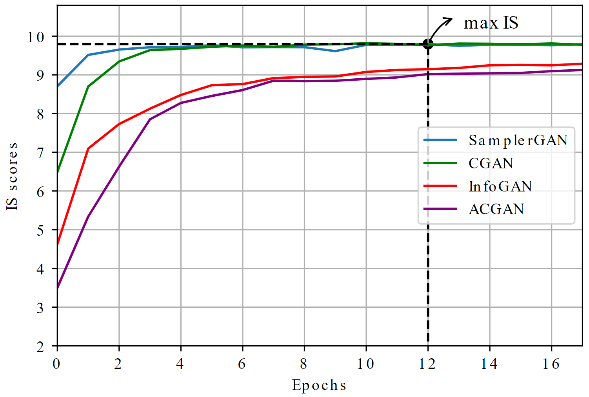
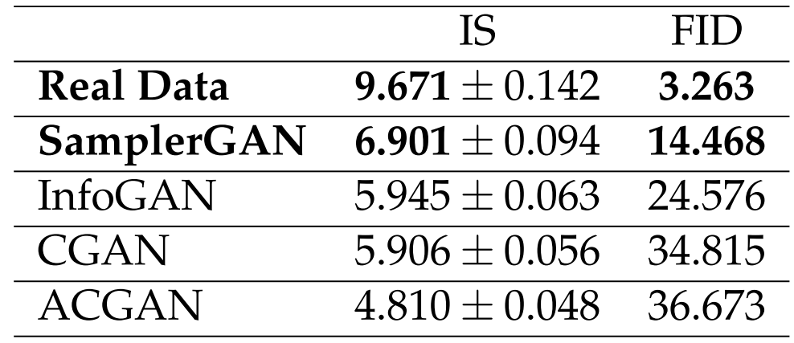

# Implicit Embedding of Conditions with CGANs  

Designing and implementing a novel approach, named SamplerGAN, for generating high-quality labeled data to find out the impact of explicit vs. implicit conditioning on GANs.
  
## Features  
* The proposed model, SamplerGAN, and the baseline models implemented with [PyTorch](https://pytorch.org/) (see [list](#available-models))  
* Utilities for loading and iterating over datasets on image and time series domains  (see [list](#available-datasets)) 
* Utilities to define hyper-parameter ranges to tune models  
* Utilities to evaluate models performance quantitatively and qualitatively

## Abstract
Deep learning techniques have recently attained state-of-the-art performance for a variety of applications. However, these approaches usually need a huge number of labeled examples that are expensive, time-consuming, or extremely difficult to acquire in many real-world situations. Conditional Generative Adversarial Networks (CGANs) address this problem through generating realistic artificial labeled data with remarkable success. The conditional information should be provided and integrated into the CGAN's network architecture explicitly. Their performance is highly dependent on the integration location of conditional information into the networks, and a global consensus on the ideal place for condition integration does not exist. Therefore, the appropriate place for integrating the condition into the network needs to be determined by trial and error, which is a cumbersome task. In this thesis, we propose a novel approach for generating high-quality labeled data, which addresses the condition integration problem. In our method, conditions are no longer required to be explicitly provided for GANs. Instead, we embed the class-conditional information into the GANs structure's input. Thus, concerns about locating the most suitable place for integrating conditions into the network are resolved. Through experiments on several datasets on image and time-series domains, we quantitatively and qualitatively demonstrate that the proposed model is capable of generating conditional data effectively. The experimental findings on the image domain indicate that our proposed approach can generate meaningful images with high diversity. Furthermore, our technique outperforms other baselines on the time-series domain on four distinct UCR datasets, improving IS and FID values by an average of $26.87\%$ and $57.70\%$, respectively.

## Proposed model: SamplerGAN
### The architecture of the proposed SamplerGAN model


### The architecture of the proposed Sampler module

  
## Available models  
  Model name      | Domain                 | Architecture                        | References  
:----------------:|:----------------------:|:-----------------------------------:|:-----------:  
SamplerGAN        | Image, Time series     | Linear, CNN, RNN (GRU/LSTM), TCN    | -
InfoGAN           | Image                  | Linear, CNN                         | [InfoGAN](https://doi.org/10.48550/arXiv.1606.03657)
CGAN              | Image                  | Linear, CNN                         | [CGAN](https://doi.org/10.48550/arXiv.1411.1784)
ACGAN             | Image                  | Linear, CNN                         | [ACGAN](https://dl.acm.org/doi/10.5555/3305890.3305954)
RCGAN             | Time series            | RNN (GRU/LSTM) , TCN                | [RCGAN](https://doi.org/10.48550/arXiv.1706.02633)              

## Available datasets 
  Name              | Domain           | Feature
:------------------:|:----------------:|:-----------------------------------------------------------------
MNIST               | Image            | Black and white images of handwritten numerals 0-9
CIFAR-10            | Image            | Colorful images of nature scenes
SmoothSubspace      | Time series      | <u>Low</u> class number \& <u>low</u> time step length
Strawberry          | Time series      | <u>Low</u> class number \& <u>high</u> time step length
Crop			    | Time series      | <u>High</u> class number \& <u>low</u> time step length
FiftyWords          | Time series      | <u>High</u> class number \& <u>high</u> time step length

## Running 
All the models can be run on the <u> image domain </u> as follows:
```
bash run_images.sh
```
where four models of `{SamplerGAN, CGAN, InfoGAN, ACGAN}` are trained and evaluated over datasets of `{MNIST, CIFAR-10}`. 

<br/>

All the models can be run on the <u> time series domain </u> as follows:
```
bash run_timeSeries.sh
```
where two models of `{SamplerGAN, RCGAN}` are trained and evaluated over datasets of `{SmoothSubspace, Strawberry, Crop, FiftyWords}`, utilizing three different architectures of `{Linear, RNN, TCN}`. 

## Results
### Evaluation on the image domain
#### MNIST
SamplerGAN and CGAN models better reflect the real distribution of the MNIST dataset, although SamplerGAN is a little more successful.
<p>
 &nbsp;

<p>
Figures below display synthetic images generated by the SamplerGAN model versus real MNIST images. As we can observe, SamplerGAN can cover a broader range of styles with high diversity and fidelity.
<p>
 &nbsp;


#### CIFAR-10
<p>

<p>
Figures below illustrate the visual results of SamplerGAN on the CIFAR-10 dataset versus real images.
<p>
 &nbsp;


### Evaluation on the time-series domain
Quantitative results:
<p>


Qualitative results:
<p>

<p>


#### Comparison of the models performance in the timeseries domain


## Work in Progress
* Evaluating models on a wider range of datasets, such as those comprising multivariate real-world time-series data.
* Investigating not just labels as conditional information, but also utilizing images or time-series as conditions on data.
* Considering alternative architectures for the proposed concept of implicitly embedding conditional information in different GAN-based architectures. For example, it would be interesting to explore what would happen if we implicitly embed the conditional information into the generator and enable the discriminator to predict them (similar to the ACGAN model).